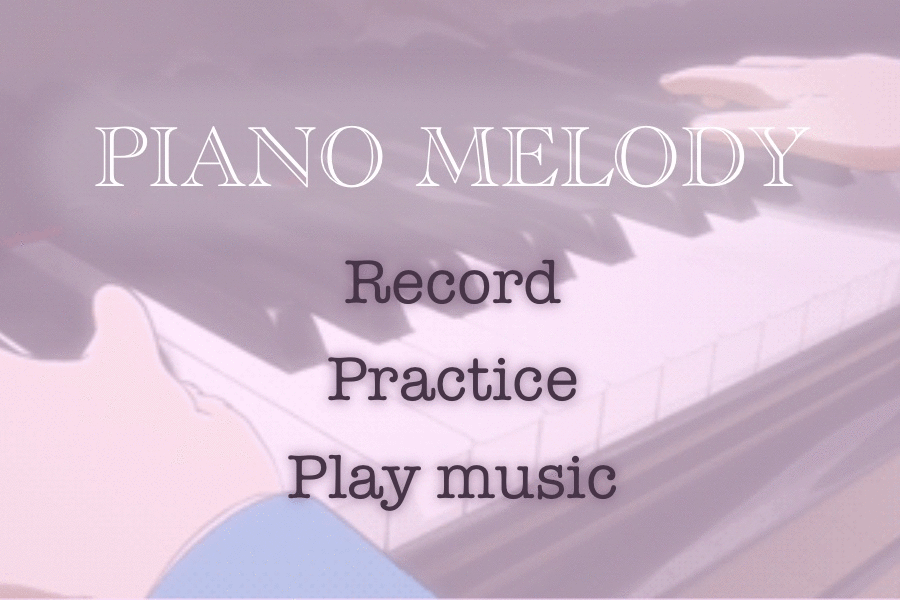
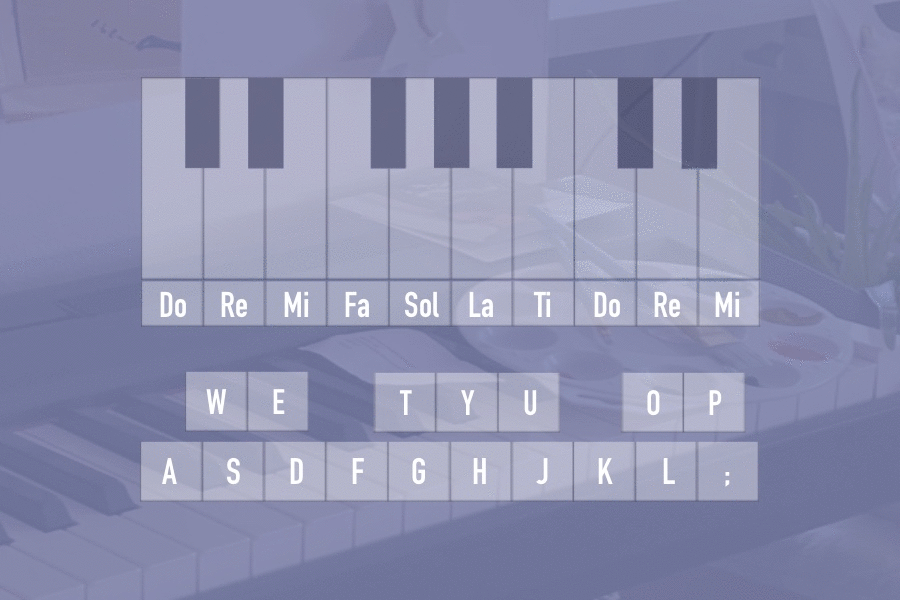
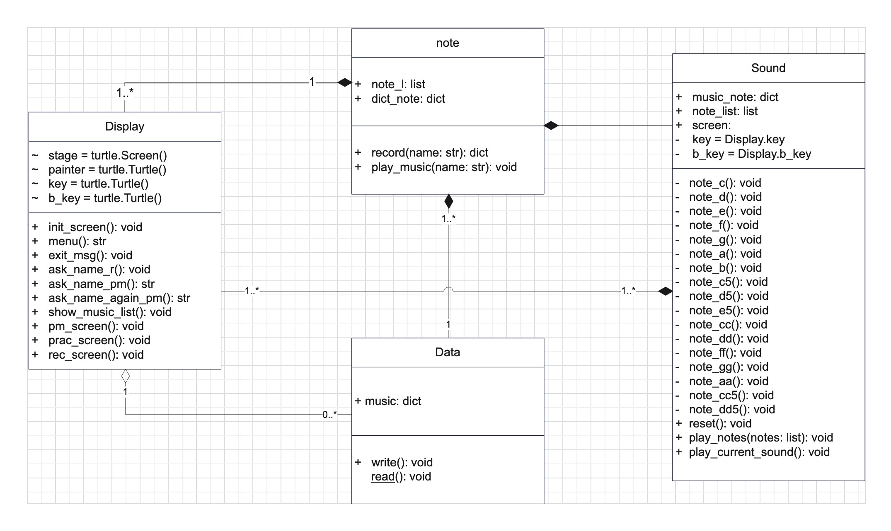

# Piano Melody
This program is a part of Computer Programming 1 course.
Inspired by my hobbies, playing the piano.

### Overview and features
This program makes you play the piano and record the music.



There are three menus for all users:

**There are three menus for all users:**
* record: Users can record their music in the database after playing the piano.
* practice: Users can play the piano without recording music,  just practicing.
* play music: The program will display a list of recorded songs and ask for the name of the song 
  that the user wants to listen to. The program then plays the song selected by the user.

**More for users about playing the piano in this program:**
```
The player must play the piano by pressing the keyboard. 
For recording, to add a rest note (pause rhythm), Player has to press the spacebar to stop 1 beat. 
Players can record the same song over and over again. The recorded sound will be the last played.
```


### Program’s requirement

There are 4 Python modules & libraries required in the program.
* [`turtle`](https://docs.python.org/3/library/turtle.html): used for the display part.
* [`sys`](https://docs.python.org/3.11/library/sys.html): used to exit the program.
* [`json`](https://docs.python.org/3/library/json.html?highlight=json#module-json): used for the data part.
* [`time`](https://docs.python.org/3.11/library/time.html): used for the sound part.
* [`playsound`](https://pypi.org/project/playsound/): used for playing sound.
Please download font Times New Roman for a better experience.

### Program design

There are four classes in this program.
* `Display`: This class is for the graphic part in the program. 
   The class attributes are the turtle which is used to create the graphical output 
   e.g. menu screen, piano keys, music list etc.
* `Note`: This class will work on music titles and notes. For making song data for use in recording 
   and playing music by searching the song name. The class attributes are a list of notes (that the user has played) 
   and all music with notes from the database.
*  `Sound`: This class will mainly work on sound. (sound when playing the piano or when playing music) 
   and will work on keyboard binding to receive input when the user presses a keyboard. 
   There is also a work using attributes which is a turtle from another class to be used for displaying results when users play notes as well.
*  `Data`: This class is for read and write the json file. To store the music with the notes in the database.

This is the program's class diagram



### Code structure
This program consists of 5 python files and 1 json file, which is the music database.
* [`main.py`](main.py): run the main program.
* [`note.py`](note.py): contains the Note class.
* [`sound.py`](sound.py): contains the Sound class.
* [`display.py`](display.py): contains the Display class.
* [`data.py`](data.py): contains the Data class.
* [`database.json`](database.json): contains the data of music with the notes.
